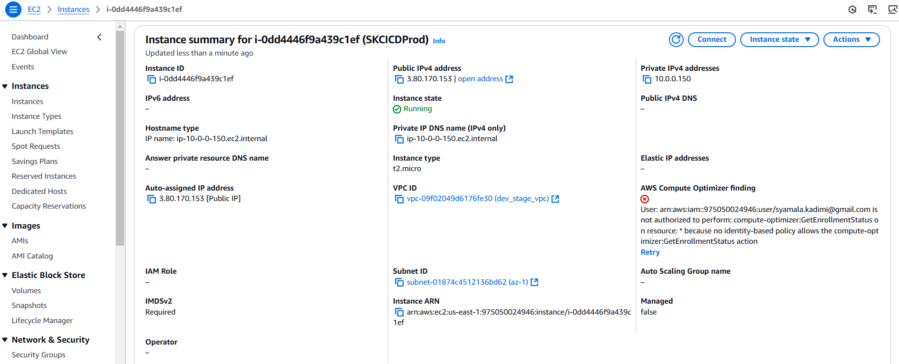
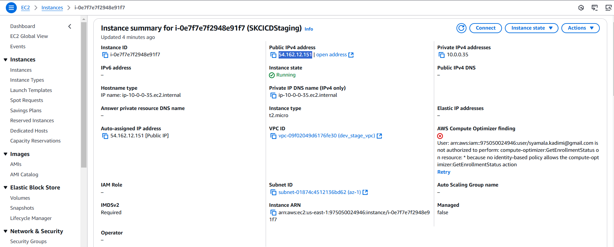
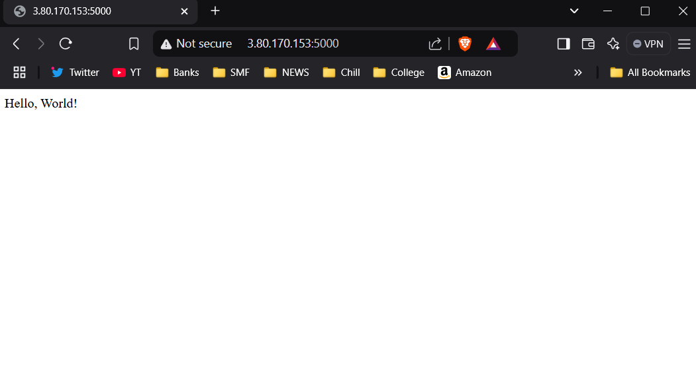
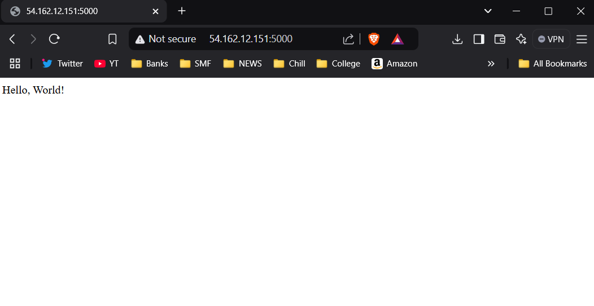
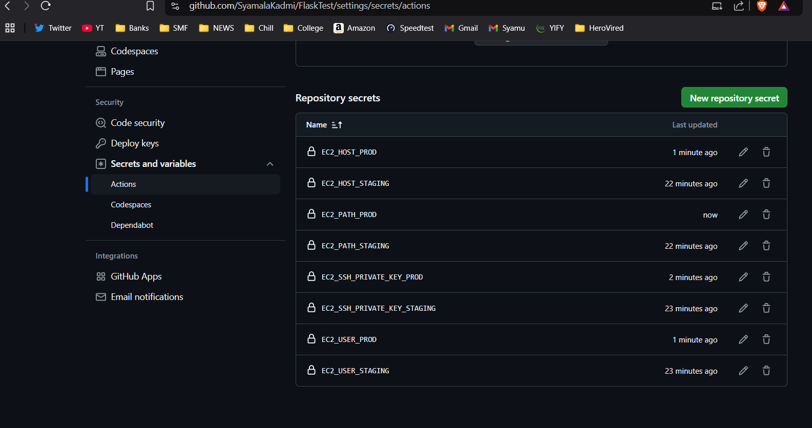
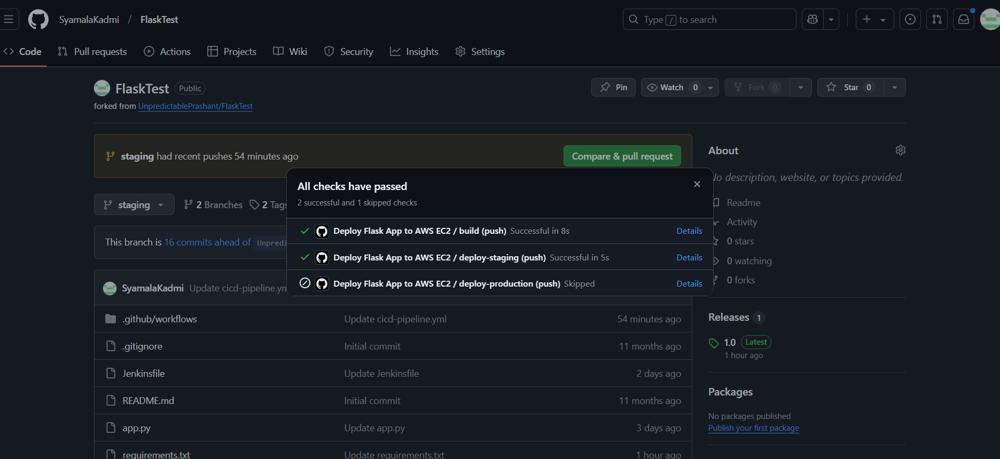
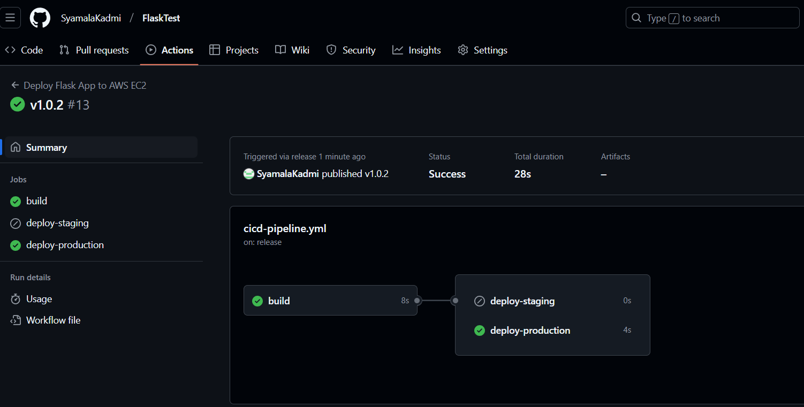

# Graded Assignment on CI/CD Pipeline


## GitHub Actions CI/CD Pipeline Flask App

### Overview
This project sets up a CI/CD pipeline using Github Actions on an AWS EC2 instance for a Flask application.

## Workflow
1. **Build** - Installs dependencies using pip.
2. **Test** - Runs unit tests using pytest.
3. **Deploy to Staging** - Deploy the application to a staging environment when changes are pushed to the staging branch. 
4. **Deploy to Production** -  Deploy the application to production when a release is tagged.

## Setup

### EC2 Setup for Staging & Production servers setup
1. Login to AWS and go to the EC2 Dashboard.
2. Click Launch Instance and configure:
    - AMI: Choose Amazon Linux 2.
    - Instance Type: Select t2.micro (Free Tier) or higher if needed.
    - Security Group:
        - Allow SSH (port 22) for remote access.
        - Allow HTTP (port 5000) for flask application
        - Allow Jenkins (port 8080).
        - Allow email configuration (Port 465)
    
3. Repeat the same for creating the Staging environment
    

### Setting up the environments on Staging & Prod servers
1. Login to the created EC2 instances
6. Install python, Flask and git on EC2 instances
    ```bash
        sudo yum install -y python3 python3-pip
        sudo yum install git -y
        sudo pip install flask
        sudo pip install pytest
    ```

### Clone Source Code in Staging & Prod Servers
1. Forked Flasktest repository which contains a Flask application with pytest included from [UnpredictablePrashant/FlaskTest](https://github.com/UnpredictablePrashant/FlaskTest) to my github - https://github.com/SyamalaKadmi/FlaskTest.git 
2. In the EC2 instance, clone the repository using
    ```bash
        git clone https://github.com/SyamalaKadmi/FlaskTest.git
        cd FlaskTest
    ```
3. Manually deploy the application and verify that it is working
    - sudo python3 app.py
    - Production
      
    - Staging
      
   

### Configure GitHub Actions for EC2 Deployment
1. For staging: Add EC2 SSH Key to GitHub
    - On staging EC2 instance, generate an SSH Key:
    ```bash
        ssh-keygen -t rsa -b 4096
    ```
    - Copy the public key
    ```bash
        cat ~/.ssh/id_rsa.pub
    ```
    - Go to the repository -> Settings → Deploy Keys → Add Key. Paste the public key and enable write access
2. Add EC2 Private Key to GitHub Secrets
    - Get the private key:
    ```bash
        cat ~/.ssh/id_rsa
    ```
    - Go to GitHub → Your Repository → Settings → Secrets and variables → Actions.
        - Click New Repository Secret and add:
            - EC2_SSH_PRIVATE_KEY → (Paste the private key)
            - EC2_USER → ec2-user
            - EC2_HOST → Public ip of Staging EC2 instance
            - EC2_PATH → /home/ec2-user/FlaskTest
3. Perform the same steps for the Production environment
   

### Create Github Actions Workflow
1. Inside the repository, create a Github Actions workflow file:
    ```bash
        mkdir -p .github/workflows
        touch .github/workflows/cicd-pipeline.yml
    ```
2. Open cicd-pipeline.yml and define the workflow - [cicd-pipeline.yml](cicd-pipeline.yml)
    
### Verification
1. Push a new change to the staging branch and verify whether a new workflow is triggered automatically and deploying only to Staging
       
2. Deploy to Prod. Run the below commands and see a workflow is triggered automatically and deploying only to production
    ```bash
        git tag v1.0.2
        git push origin v1.0.2
    ```
    - Output
      

2. Navigate to the browser - 
    - http://<stagingurl>:5000/ to verify the app is running
      
    - Repeat the same steps for Production server
