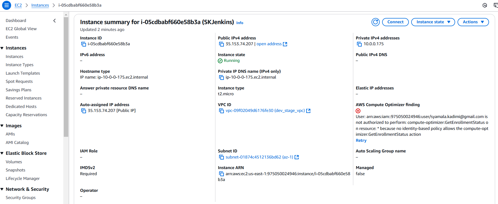
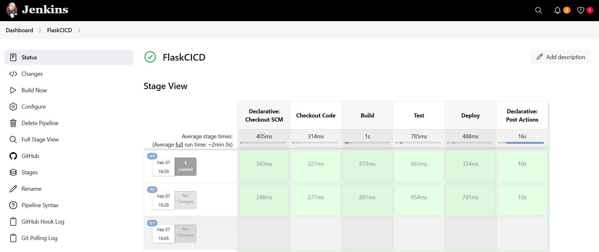
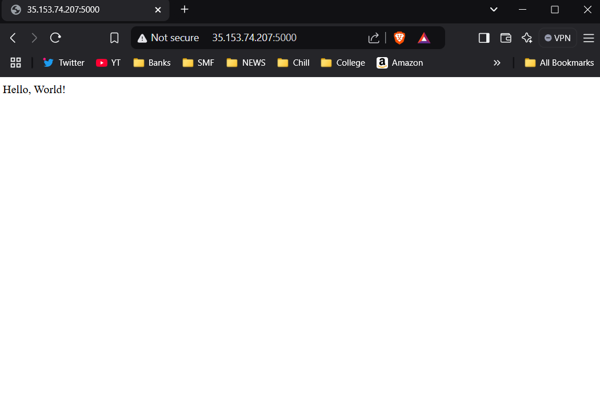

# Graded Assignment on CI/CD Pipeline


## Jenkins CI CD pipeline for flask application

### Overview
This project sets up a CI/CD pipeline using Jenkins on an AWS EC2 instance for a Flask application.

## Workflow
1. **Build** - Installs dependencies using pip.
2. **Test** - Runs unit tests using pytest.
3. **Deploy** - Deploys the Flask app on EC2 when pushed to the `main` branch.

## Setup

### EC2 Setup
1. Login to AWS and go to the EC2 Dashboard.
2. Click Launch Instance and configure:
    - AMI: Choose Amazon Linux 2.
    - Instance Type: Select t2.micro (Free Tier) or higher if needed.
    - Security Group:
        - Allow SSH (port 22) for remote access.
        - Allow HTTP (port 5000) for flask application
        - Allow Jenkins (port 8080).
        - Allow email configuration (Port 465)
    

### Jenkins Setup
1. Login to the created EC2 instance
2. Install Java (Required for Jenkins)
    ```bash
        sudo yum update -y
        sudo yum install -y java-11-amazon-corretto
    ```
3. Add Jenkins repository
    ```bash
        sudo wget -O /etc/yum.repos.d/jenkins.repo https://pkg.jenkins.io/redhat-stable/jenkins.repo
        sudo rpm --import https://pkg.jenkins.io/redhat-stable/jenkins.io-2023.key
    ```
4.  Install & Start Jenkins
    ```bash
        sudo yum install -y jenkins
        sudo systemctl start jenkins
        sudo systemctl enable jenkins
    ```
5. Access Jenkins
    - Get the initial password from 
    ```bash
        sudo cat /var/lib/jenkins/secrets/initialAdminPassword
    ```
    - Open Jenkins in the browser: http://35.153.74.207:8080/ and enter the copied password and setup an admin user
    - Install the required plugins for running the CICD Pipeline - Git, Github, Email Extension, Mailer plugins etc..
6. Install python and Flask on EC2
    ```bash
        sudo yum install -y python3 python3-pip
    ```

### Clone Source Code
1. Forked Flasktest repository which contains a Flask application with pytest included from [UnpredictablePrashant/FlaskTest](https://github.com/UnpredictablePrashant/FlaskTest) to my github - https://github.com/SyamalaKadmi/FlaskTest.git 
2. In the EC2 instance, clone the repository using
    ```bash
        git clone https://github.com/SyamalaKadmi/FlaskTest.git
        cd FlaskTest
    ```

### Create Jenkins pipeline & Github Webhook
1. Created a JenkinsFile inside FlaskTest repository using 
    ```bash
        sudo vi JenkinsFile
    ```
    This opens up an editor to enter the details for JenkinsFile [JenkinsFile](Jenkins/JenkinsFile)
2. JenkinsFile should fetch the code from github repository, check for any commits every 5 minutes, install dependencies from requirements.txt using pip, test using    pytest, deploy the application and send emails upon build completion
    ```JenkinsFile
    pipeline {
        agent any

        environment {
            VENV_PATH = "${WORKSPACE}"
        }

        triggers {
            pollSCM('H/5 * * * *')  // Checks for changes every 5 minutes
        }

        stages {
            stage('Checkout Code') {
                steps {
                    git branch: 'main', url: 'https://github.com/SyamalaKadmi/FlaskTest.git'
                }
            }

            stage('Build') {
                steps {
                    script {
                        sh 'pip install -r requirements.txt'
                    }
                }
            }

            stage('Test') {
                steps {
                    script {
                        sh 'pytest --junitxml=test-results.xml'
                    }
                }
            }

            stage('Deploy') {
                when {
                    expression { currentBuild.result == null || currentBuild.result == 'SUCCESS' }
                }
                steps {
                    sh 'nohup python3 app.py > flask.log 2>&1 &'
                }
            }
        }

        post {
            success {
                emailext subject: "Jenkins Build Success: ${JOB_NAME}",
                        body: "Build #${BUILD_NUMBER} for ${JOB_NAME} succeeded.\nCheck: ${BUILD_URL}",
                        to: 'syamala.kadimi@gmail.com'  // Ensure this is correct'
            }
            failure {
                emailext subject: "Jenkins Build Failed: ${JOB_NAME}",
                        body: "Build for ${JOB_NAME} failed.\nCheck logs: ${BUILD_URL}",
                        to: 'syamala.kadimi@gmail.com'
            }
        }
    }
    ```
3. Create Jenkins Pipeline Job
    - Open Jenkins Dashboard → Click New Item.
    - Select Pipeline, name it FlaskCICD, and click OK.
    - Under Pipeline Definition, choose "Pipeline script from SCM."
    - Select Git, enter your repository URL.
    - Under Branches to build, enter main.
    - Save and run the pipeline.


4. Configure Github Webhook
    - Go to the GitHub repository → Click Settings → Click Webhooks.
    - Click "Add Webhook" and set:
        - Payload URL:
        ```
            http://35.153.74.207:8080/github-webhook/
        ```
    - Content type: application/json
    - Trigger: Select Just the push event.
    - Click Add Webhook.
5. Update the Jenkins Pipeline Job
    - Open Jenkins Dashboard → Click on FlaskCICD Job.
    - Click Configure.
    - Under Build Triggers, check - GitHub hook trigger for GITScm polling.
    - Save the configuration.

### Verification
1. Push a new change to the main branch and verify whether a new build is triggered automatically
    - 
2. Navigate to the browser - http://35.153.74.207:5000/ to verify the app is running
    - 


